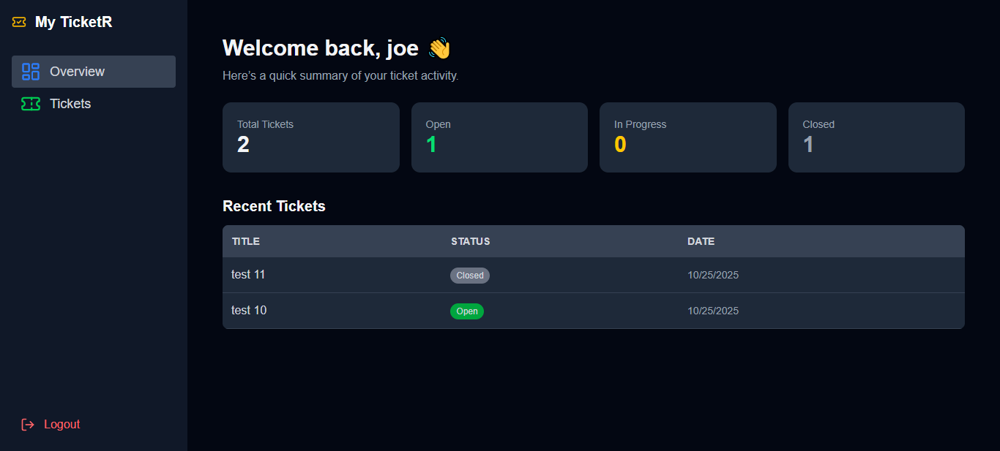
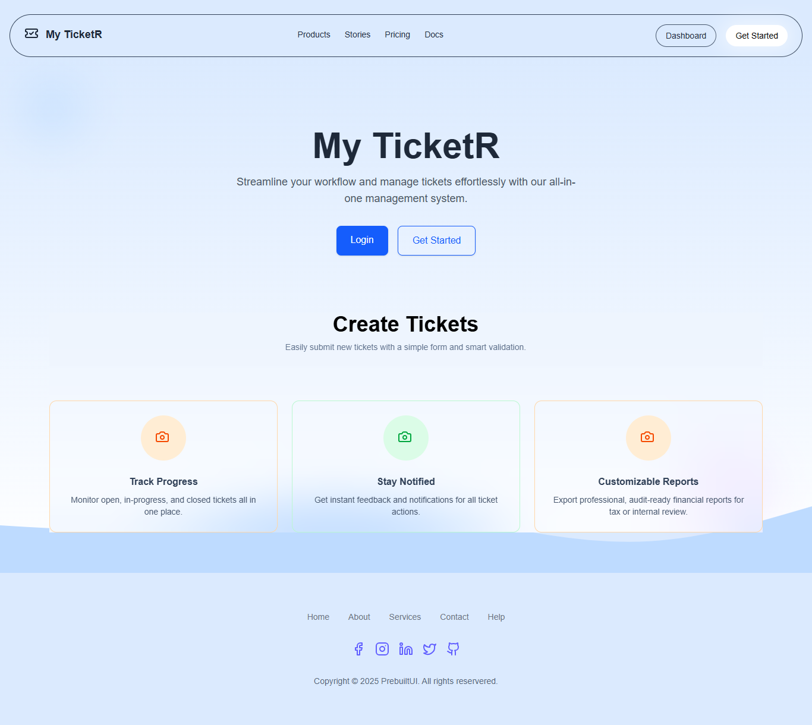

# 🧩 React Version — Ticket Management App

## 📖 Overview

A robust **Ticket Management Web Application** built with **React** and **Tailwind CSS**, featuring user authentication, ticket creation, editing, and deletion — all managed locally using **localStorage**.

This app allows multiple users to create accounts, log in, and manage their personal tickets securely within the same browser session.

---

## 🚀 Features

- 🏠 Landing Page with CTA buttons ("Login" & "Get Started")
- 🔐 Authentication System (Signup, Login, Logout)
- 🎫 Ticket Dashboard (Add, Edit, Delete tickets)
- 🧠 Persistent Sessions using localStorage
- 🎨 Modern UI/UX with Tailwind CSS and Lucide Icons
- ⚡ Responsive Design (Desktop & Mobile friendly)

---

## 🛠️ Tech Stack

- **React** (Vite)
- **Tailwind CSS**
- **Lucide-React**
- **localStorage**

---

## 📂 Folder Structure

```
src/
├── components/
│   ├── Navbar.jsx
│   ├── TicketCard.jsx
│   └── TicketForm.jsx
├── context/
│   └── AuthContext.jsx
├── pages/
│   ├── LandingPage.jsx
│   ├── Login.jsx
│   ├── Signup.jsx
│   └── Dashboard.jsx
├── services/
│   └── ticketService.js
├── App.jsx
└── main.jsx
```

---

## ⚙️ Setup Instructions

```bash
# Clone repository
git clone https://github.com/yourusername/react-ticket-app.git
cd react-ticket-app

# Install dependencies
npm install

# Start the app
npm run dev
```

---

## 🧠 How Data Works

- User info and tickets are saved in `localStorage`.
- Each ticket is tied to a user’s email.
- When a user logs in, only their tickets are displayed.

---

## 🔑 Example Login Flow

1. Sign up with a name, email, and password
2. You’ll be prompted to log in
3. After login, you’ll see your personalized dashboard
4. Log out anytime — your tickets remain saved locally

---

## 📸 Screenshots

## 

## 

## 👨‍💻 Author

**Joseph Olaniyi**  
Frontend Developer | React | Vue | Tailwind  
[LinkedIn](#) • [GitHub](#)
