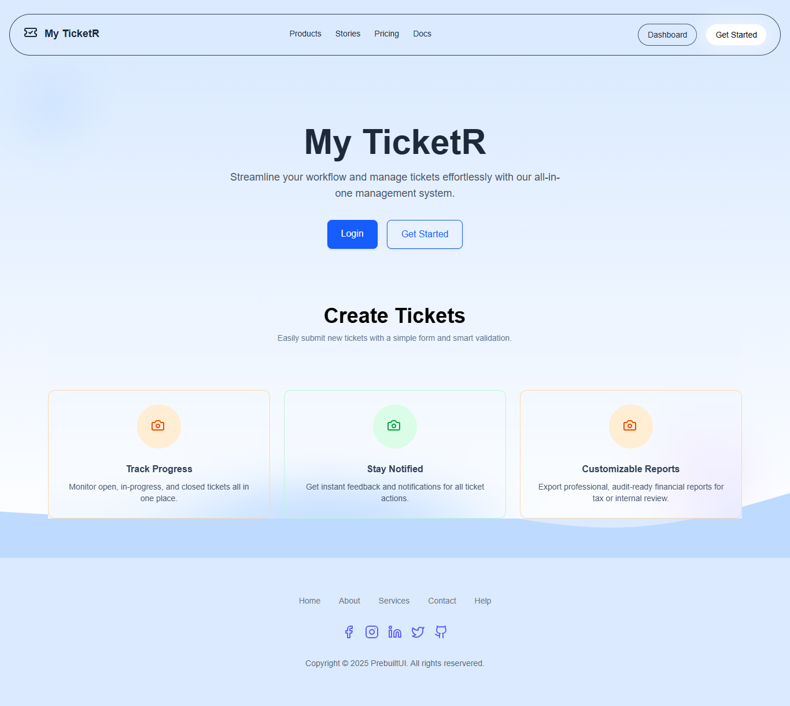

# 🧩 Vue Version — Ticket Management App

## 📖 Overview

The **Vue 3 + Vite** version of the Ticket Management App replicates the same UI and UX as the React version, ensuring a consistent experience across frameworks.  
It uses **composables** and **localStorage** for authentication and ticket handling — no backend required.

---

## 🚀 Features

- 🏠 Landing Page with CTA buttons
- 🔐 Signup, Login & Logout system
- 🎫 User-specific tickets (create, edit, delete)
- 🧠 Data persistence via localStorage
- 🎨 Styled with Tailwind CSS
- ⚡ Lucide-Vue icons for consistency

---

## 🛠️ Tech Stack

- **Vue 3** (Vite)
- **Tailwind CSS**
- **Lucide-Vue**
- **Pinia/Composables**
- **localStorage**

---

## 📂 Folder Structure

```
src/
├── components/
│   ├── Navbar.vue
│   ├── TicketCard.vue
│   └── TicketForm.vue
├── composables/
│   ├── useAuth.js
│   └── useTickets.js
├── pages/
│   ├── LandingPage.vue
│   ├── Login.vue
│   ├── Signup.vue
│   └── Dashboard.vue
├── services/
│   └── ticketService.js
├── App.vue
└── main.js
```

---

## ⚙️ Setup Instructions

```bash
# Clone repository
git clone https://github.com/yourusername/vue-ticket-app.git
cd vue-ticket-app

# Install dependencies
npm install

# Start development server
npm run dev
```

---

## 🧠 How Data Works

- Every user’s data (auth + tickets) is stored in the browser’s localStorage.
- Tickets are filtered by the currently logged-in user.
- Logging out doesn’t remove data — users can log back in to access previous tickets.

---

## 🔑 Example Usage

1. Create an account → You’ll be prompted to log in
2. Add new tickets from your dashboard
3. Edit or delete your tickets anytime
4. Switch users to simulate multiple accounts

---

## 📸 Screenshots

## 

## 

---

## 👨‍💻 Author

**Joseph Olaniyi**  
Frontend Developer | React | Vue | Tailwind  
[LinkedIn](#) • [GitHub](#)
